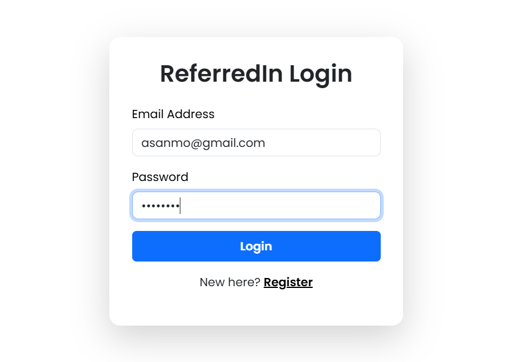
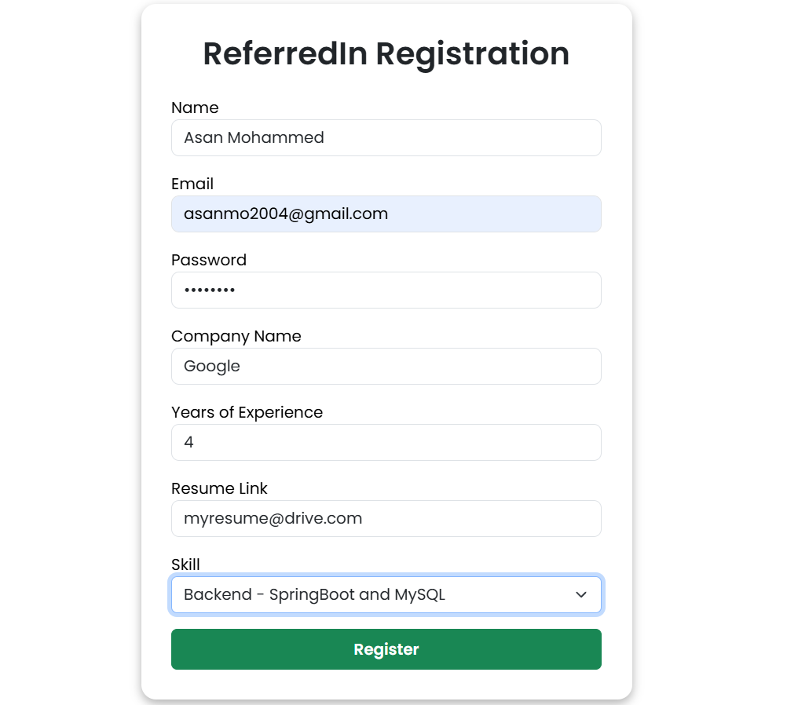
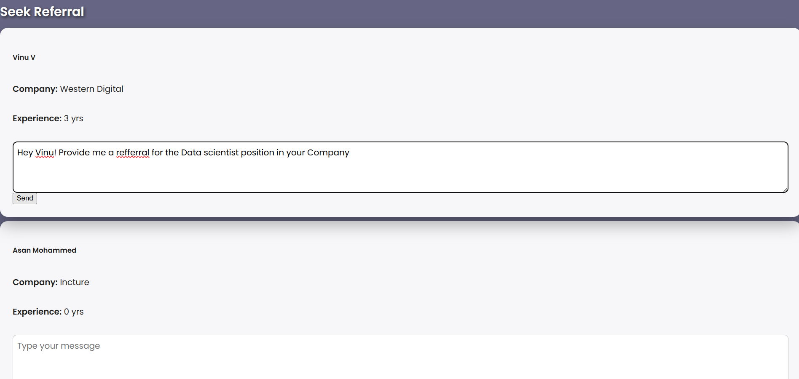
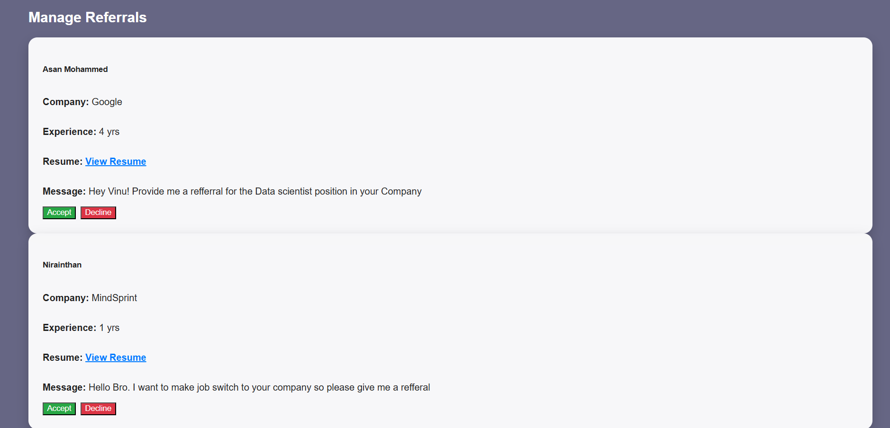
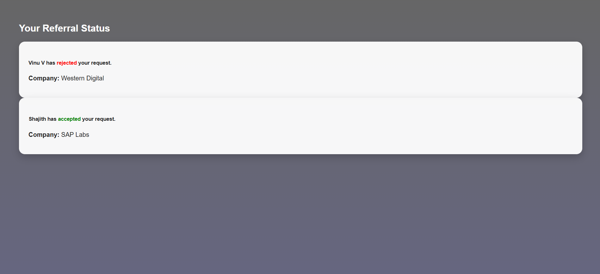

# 📚 ReferredIn - Referral Management System

A web-based Social Media application built using **Spring Boot (Backend)** and **React.js (Frontend)** to streamline the process of Seeking and Providing referrals to the people seamlessly.

---

## 🚀 Steps to Run the Application

### ⚙️ Prerequisites

- Java 17
- MySQL running locally (or remote)
- IntelliJ IDEA or another Java IDE
- Maven installed
- React.js

---

### ⚠️ Initial Setup

1. **Configure your MySQL credentials** in:
   `src/main/resources/application.properties`

```properties
spring.datasource.url=jdbc:mysql://localhost:3306/{db-name}
spring.datasource.username={db-username}
spring.datasource.password={db-password}
spring.jpa.hibernate.ddl-auto=update
```

2. **Create the database manually**:

```sql
CREATE DATABASE {db-name};
USE {db-name};
```

---

### 🧪 Run the Project

#### Backend

- Open the project '/rms' in cmd

mvn clean install
mvn spring-boot:run


#### Frontend
- Open the project '/frontend' in cmd

npm install
npm start


## 🧭 Features

### 👨‍💼 User Management

- Register the ReferredIn account easily in a Visually appealing GUI.
- Only Authenticated Users are allowed to log in to the system.

### 🏢 Requesting Referrals

- This feature list down all the Users with send button to send referrals.
- Also send Custom message to the referrer. 

### 🧑‍💼 Manage Incoming Referrals

- Listing down of all Incoming referral requests.
- Have the option to accept and decline the referral request.

### 👤 View Status

- provides updates for seekers when requests are accepted or declined


---


## ✅ Tech Stack
- **Frontend:** React
- **Backend:** Spring Boot
- **Database:** MySQL
- **Testing:** Postman

---
## 📸 Screenshots

### 🔐 Login Page


### 📨 Registration Page

### 📊 Seek Referrals

### 📊 Manage Incoming Requests

### 📊 Status Tracker


## 📝 Author

Asan Mohammed

